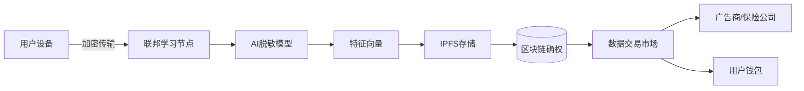

# MedAsset-Nexus
一种基于区块链的AI健康数据资产化平台

### **一句话描述**
我们构建了一个基于DePIN架构的可穿戴设备数据网络，通过与区块链智能合约交互，让用户隐私安全地货币化健康数据，同时为医疗研究、保险精算和数字营销提供实时合规数据源

### **项目背景**

随着可穿戴设备普及，个人健康数据（心率、睡眠、运动等）日均产生量超10亿条，但面临：

- **数据孤岛**：数据分散在手机厂商、App开发者手中，用户无法掌控自身数据资产
- **价值流失**：广告商每年支付$500亿获取用户画像，但数据生产者（用户）未获分成
- **隐私风险**：2023年全球医疗数据泄露事件造成$420亿损失，传统中心化存储隐患巨大

### **技术方案**

**核心架构**：联邦学习（AI） + Hyperledger Fabric（区块链） + IPFS（分布式存储）

### **数据流转闭环**    

1. **采集端**
    - 支持Apple Watch/Garmin等30+设备数据接入，SDK日均采集500万条体征数据
    - 本地化预处理：在用户手机端执行数据清洗（剔除异常值）与格式标准化
2. **AI脱敏层**
    - 采用**联邦学习**训练特征提取模型，各节点仅上传模型梯度，原始数据不出域
    - 通过**k-匿名化**处理：确保任意用户的特征向量在10万人群中不可区分
    - 生成标准化数据资产包：`{运动画像哈希, 健康评分, 消费倾向标签}`
3. **区块链确权**
    - 数据资产NFT化：每个数据包映射为ERC-1155代币，记录创建时间/使用权限
    - 智能合约自动分账：广告商每次调用数据支付费用的70%直达用户钱包
    - 合规审计通道：监管机构可穿透查询数据使用记录，确保符合GDPR/CCPA
  
### **行业应用场景**

1. **精准健康保险**
    - 保险公司根据运动数据动态定价：每日步数>8000用户享9折保费
    - 用户通过分享睡眠数据获得健康积分，可兑换体检服务
2. **医药研发**
    - 药企购买脱敏的疾病发展轨迹数据，加速临床试验设计
    - 研究机构追踪10万+糖尿病患者数据，发现血糖波动新关联因子
3. **个性化推荐**
    - 运动品牌定向推送健身装备给高频跑步用户，转化率提升27%
    - 基于心率变异性（HRV）数据，心理健康App提供实时压力干预
